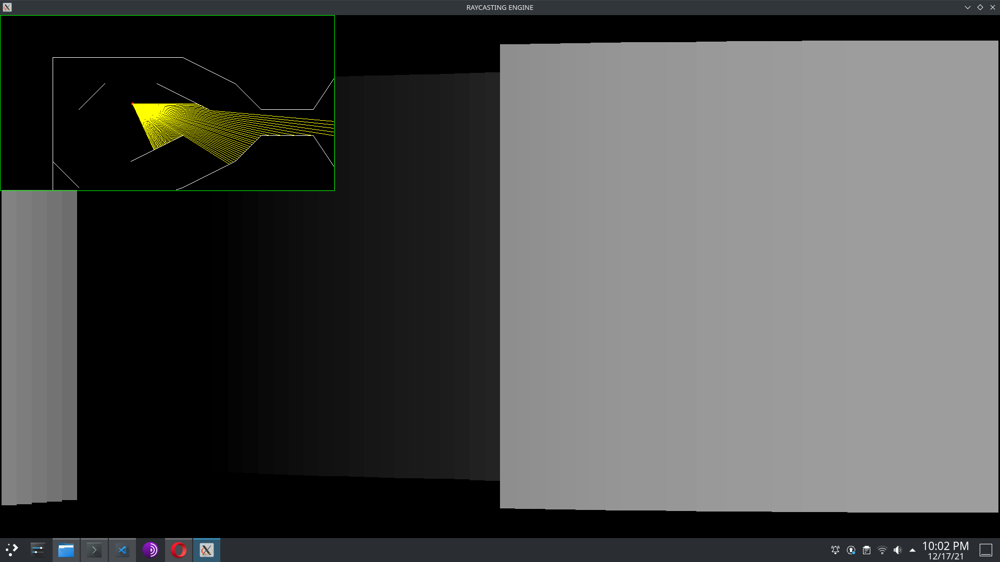
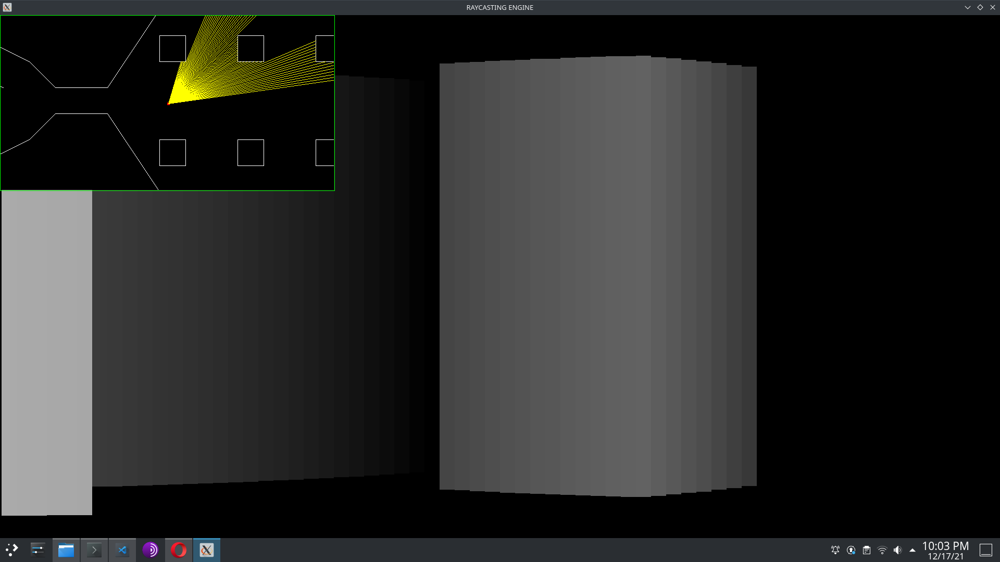
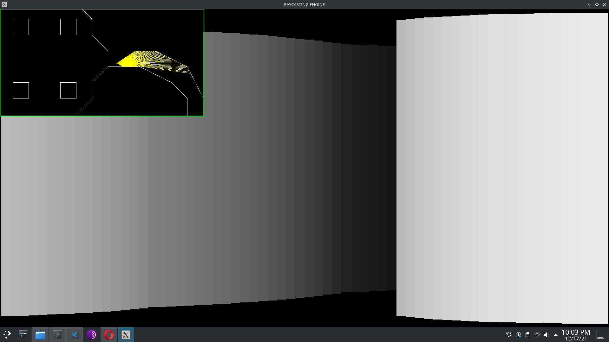
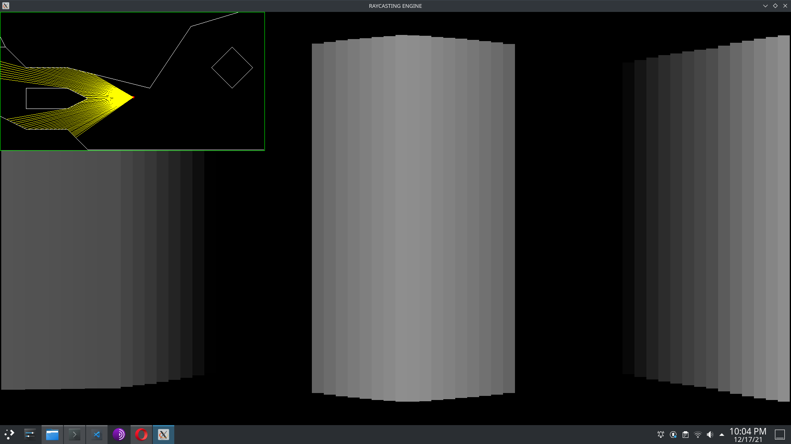

# RC ENGINE

## simple raycasting engine


Here a simple raycasting able to display the map that you can **create !!**

-> Go to ```data/map``` and create yours own maps

-> the first line is the number of walls on your map
-> each line is composed with 4 numbers (the coordinates x, y and x, y of two points to draw your line).

**IMPORTANT** -> your map needs to be closed.


## CONTROLS

to move the view of the player :

```A```and ```D```

to move the player :

                  ```ARROW_UP```
```ARROW_LEFT``` ```ARROW_DOWN``` ```ARROW_RIGHT```


## PICTURES of the engine







